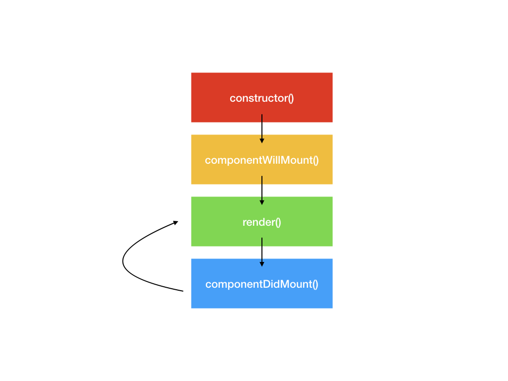

<!-- page_number: true -->


React Native
===

# 

##### CCI Colmar

###### Created by Kevin Faulhaber ( [@kemicofa](https://github.com/kemicofa) )

---

Do you know [ECMAScript6](http://es6-features.org/#Constants) ?
===

Specifications regarding the Javascript programming language that is to be implemented across all browsers
* [ECMA-262](https://www.ecma-international.org/publications/standards/Ecma-262.htm)


What about [ECMAScript Next](https://developer.mozilla.org/fr/docs/Web/JavaScript/Nouveaut%C3%A9s_et_historique_de_JavaScript/Support_ECMAScript_Next_par_Mozilla) ?

---

React Native Some History
===

> React (also known as React.js or ReactJS) is a JavaScript library for building user interfaces. It is maintained by Facebook and a community of individual developers and companies.


React open sourced 2013 and React Native open sourced 2015

---

What is JSX ?
===

JSX (JavaScript XML) is an extension to the JavaScript language syntax. Produces "react" elements.

---

Why JSX ?
===

Transitioning from "artificially seperating technologies" to "seperating concerns".

* no more seperation between markup and logic

---


What are components ?
===

> Components are the building blocks of any React app and a typical React app will have many of these. Simply put, a component is a JavaScript class or function that optionally accepts inputs i.e. properties(props) and returns a React element that describes how a section of the UI (User Interface) should appear.

[@EdmondAtto](https://medium.com/@EdmondAtto)

---

Class Component Example
===

```javascript
import React, { Component } from 'react';
import { Text, View } from 'react-native';

export default class HelloWorldApp extends Component {
  render() {
    return (
      <View style={{ 
      		flex: 1, 
                justifyContent: "center", 
                alignItems: "center"
            }}>
        <Text>Hello, world!</Text>
      </View>
    );
  }
}
```

---

Function Component Example
===

```javascript
import React from 'react';
import { Text, View } from 'react-native';

const HelloWorldApp = props => {
    return (
      <View style={{ 
      		flex: 1, 
                justifyContent: "center", 
                alignItems: "center"
            }}>
        <Text>Hello, world!</Text>
      </View>
    );
}
export default HelloWorldApp;

```

---

Class or Function Component ?
===


It's sometimes not easy knowing when to use one or the other. 

### Any ideas ?

---

Dummy (Function) and Smart (Class) Components
===

How to differenciate them ?

---

Dummy (Function) Components
===

### Ignorance is bliss


* Used only for "Presentational Purposes"
* Simply creates a view with input data (i.e: `props`)
* Does **NOT** have internal `state` management
* Only requires `render` method
---

Smart (Class) Components
===

Smart Components are components that have more responsibilities.


* Internal `state` management
* Handle event callbacks
* Handling lifecycle
* Fetch requests
* Passes data to "dummy" components
* etc

---


Life Cycle (Mounting)
===



---

componentWillMount()
===

### DEPRECATED


Generally used to prepare for the first render

---

render()
===

Builds the NativeUI View with all its child components

* Do **NOT** call `setState` (cannot re-render during rendering)
* Do **NOT** call external APIs

---

componentDidMount()
===

* called **once** after the first render
* all child components have been rendered
* NativeUI is fully created and available
* Can potentially make a new render call if state changed
* Recommended place to make external API calls

---

Life Cycle (Unmount)
===
```
componentWillUnmount(){
  //save anything that needs to be saved
  
  //stop anything that should be stopped
  //i.e.: setInterval ids
}
````


---

Props
===


`props` attribute is data passed to the component by its parent and exist throughout the lifetime of the component. They are **READ ONLY** !


```
//ShowMessage.js
const ShowMessage = props => {
    const {title, message} = props;
    return (
    	<View>
            <Text>{title}</Text>
            <Text>{message}</Text>
        </View>
    )
}
```

---

Props Example:
===

```
//App.js
import React from "react";
import ShowMessage from "./ShowMessage";
export default props => {
    return (
    	<View>
          <ShowMessage 
            title="Info" 
            message="Some message" />
        </View>
    );
}

```

---

State
===

The state property exists for Class Components. It is an `object` containing data on values that may change during the components lifecycle.

* Initialize `state`  in constructor
* call `setState` to modify the `state`
* `setState` re-renders component

---

State Example:
===

```javascript
class Blink extends Component {
  constructor(props) {
    super(props);
    this.state = { isShowingText: true };

    // Toggle the state every second
    setInterval(() => (
      this.setState(previousState => (
        { isShowingText: !previousState.isShowingText }
      ))
    ), 1000);
  }

  render() {
    const {isShowingText} = this.state;

    return (
      <Text>{isShowingText ? this.props.text : ""}</Text>
    );
  }
}
```


---

Style
===

Styles in React Native are CSS elements written in camelCase

`background-color` -> `backgroundColor`

Can be defined in a seperate file, within the component file, or inline with XML.

* Do **NOT** use inline styling unless it's for dynamic elements
* `StyleSheet.create` is a cleaner way of defining styles when components become complex
* By default define your StyleSheet object above your component
* Create a seperate `style.js` file when the component file becomes too large

---

Style Example:
===
```javascript
import React, { Component } from 'react';
import { StyleSheet, Text, View } from 'react-native';

const styles = StyleSheet.create({
  bigBlue: {
    color: 'blue',
    fontWeight: 'bold',
    fontSize: 30,
  },
  red: {
    color: 'red',
  },
});

export default props => {
    return (
      <View>
        <Text style={styles.red}>just red</Text>
        <Text style={styles.bigBlue}>just bigBlue</Text>
        <Text style={[styles.bigBlue, styles.red]}>bigBlue, then red</Text>
        <Text style={[styles.red, styles.bigBlue]}>red, then bigBlue</Text>
      </View>
    );
}
```
---

[Height and Width](https://facebook.github.io/react-native/docs/height-and-width)
===


Not always easy to handle !

> 
---

# [Fixed Dimensions](https://facebook.github.io/react-native/docs/height-and-width#fixed-dimensions)

> All dimensions in React Native are unitless, and represent density-independent pixels.

```
import React, { Component } from 'react';
import { View } from 'react-native';

export default class DimensionExample extends Component {
  render() {
    return (
      <View>
        <View style={{width: 50, height: 50}} />
        <View style={{width: 100, height: 100}} />
        <View style={{width: 150, height: 150}} />
      </View>
    );
  }
}
```

---

[Flex Dimensions](https://facebook.github.io/react-native/docs/height-and-width#flex-dimensions)
===

Find out more from [css-tricks](https://css-tricks.com/snippets/css/a-guide-to-flexbox/) !


---

Handling Text Inputs
===

```javascript
import { TextInput } from 'react-native';


```

---

React Navigation
===

---

[Hooks](https://reactjs.org/docs/hooks-intro.html)
===